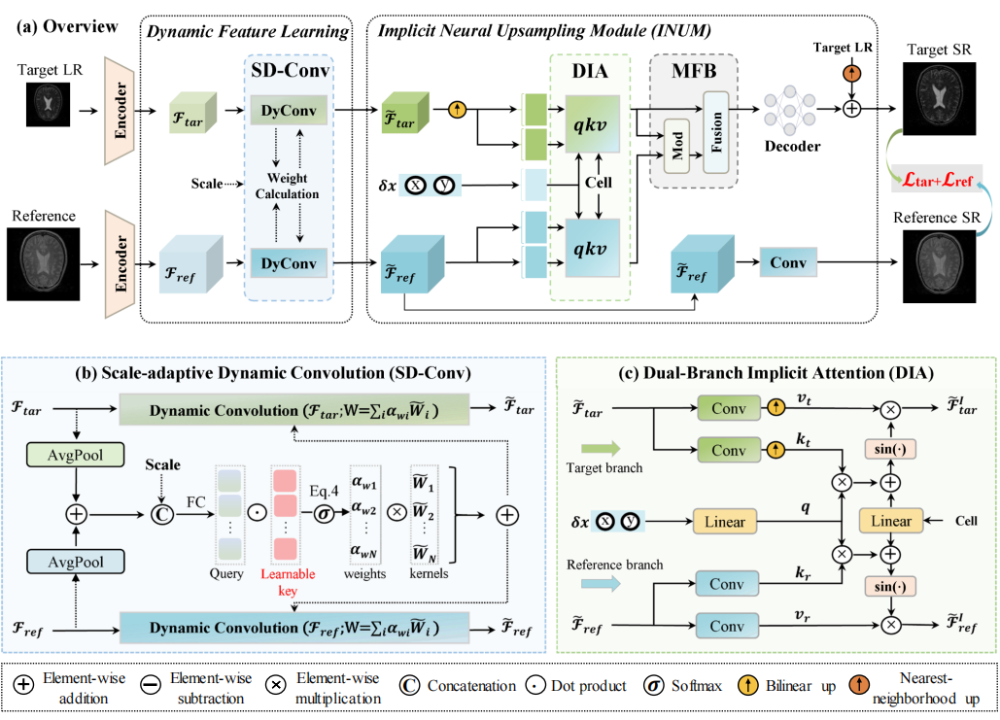

# (IEEE TCSVT) Multi-Contrast MRI Arbitrary-Scale Super-Resolution via Dynamic Implicit Network


<div align="center">

[**Jinbao Wei**](https://scholar.google.com/citations?user=KcKJI6MAAAAJ&hl=zh-CN),
[**Gang Yang**](https://scholar.google.com/citations?user=gctrxXsAAAAJ&hl=zh-CN&oi=ao),
[**Wei Wei**](https://orcid.org/0000-0003-4097-1592),
[**Aiping Liu**](https://scholar.google.com/citations?user=vEDf62sAAAAJ&hl=zh-CN),
[**Xun Chen**](https://scholar.google.com/citations?user=aBnUWyQAAAAJ&hl=zh-CN),

</div>


[[Paper]](https://ieeexplore.ieee.org/abstract/document/10945918/)



## Introduction
Multi-contrast MRI super-resolution (SR) aims to restore high-resolution target image from low-resolution one, where reference image from another contrast is used to promote this task. To better meet clinical needs, current studies mainly focus on developing arbitrary-scale MRI SR solutions rather than fixed-scale ones. However, existing arbitrary-scale SR methods still suffer from the following two issues: (1) They typically rely on fixed convolutions to learn multi-contrast features, struggling to handle the feature transformations under varying scales and input image pairs, thus limiting their representation ability. (2) They simply combine the multi-contrast features as prior information, failing to fully exploit the complementary information in the texture-rich reference images. To address these issues, we propose a Dynamic Implicit Network (DINet) for multi-contrast MRI arbitrary-scale SR. DINet offers several key advantages. First, the scale-adaptive dynamic convolution facilitates dynamic feature learning based on scale factors and input image pairs, significantly enhancing the representation ability of multi-contrast features. Second, the dual-branch implicit attention enables arbitrary-scale upsampling of MR images through implicit neural representation. Following this, we propose the modulation-then-fusion block to adaptively align and fuse multi-contrast features, effectively incorporating complementary details from reference images into the target images. By jointly combining the above-mentioned modules, our proposed DINet achieves superior MRI SR performance at arbitrary scales. Extensive experiments on three datasets demonstrate that DINet significantly outperforms state-of-the-art methods, highlighting its potential for clinical applications.

## Visualization


## Citations

You may want to cite:
```
@article{wei2025multi,
  title={Multi-Contrast MRI Arbitrary-Scale Super-Resolution via Dynamic Implicit Network},
  author={Wei, Jinbao and Yang, Gang and Wei, Wei and Liu, Aiping and Chen, Xun},
  journal={IEEE Transactions on Circuits and Systems for Video Technology},
  year={2025},
  publisher={IEEE}
}
```
